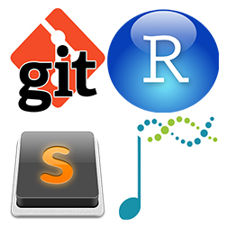
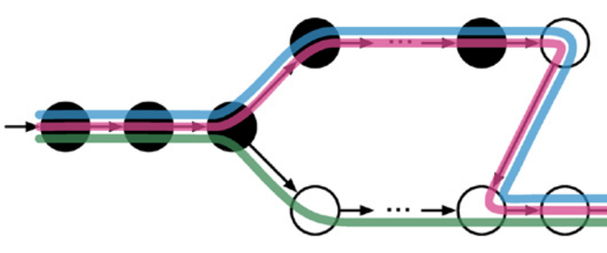
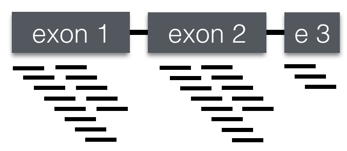
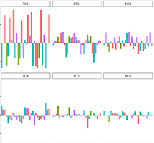
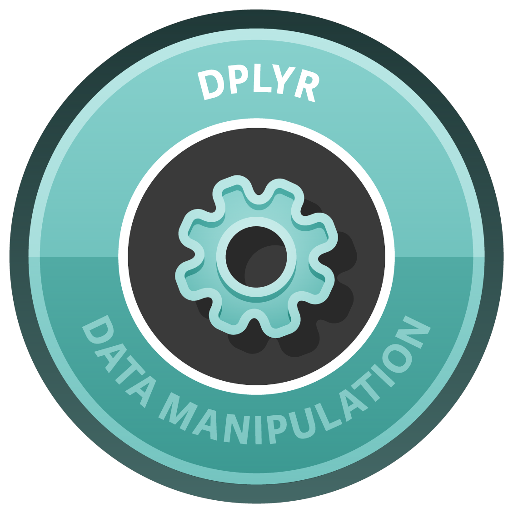
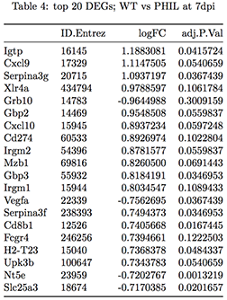
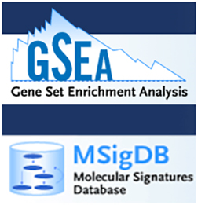
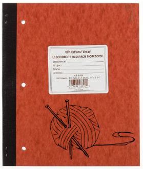
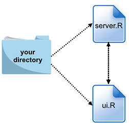



## Introduction to RNAseq data and technology

**Oct 4th** - After some introductions and a brief overview of the course, we'll spend the opening lecture talking about Illumina's 'Sequencing by Synthesis' technology, and walk through the steps involved in planning (and budgeting!) for a transcriptomics experiment.  After this lecture, words like flow cell, single-end, paired-end, indexing, cluster density, library, mRNAseq, total transcriptome, ribo-depletion, and fastq will pratically roll off your tongue.  Lecture slides available [here](https://www.icloud.com/keynote/0sBpheSjnnkSIjKEHDpzd6kmw#Lecture01%5FRNAseqIntro).

## Setting up your software environment

**Oct 11th** - In the first half of this lecture we'll discuss the open-source, cross-platform software that will be used throughout the course, and each student will set-up their own laptop to be a powerful, stand-alone bioinformatics workstation.  In preparation for this class, you'll need to download and install the [R Programming Language](http://lib.stat.cmu.edu/R/CRAN/) for your operating system, the graphical user interface for R, called [RStudio](http://www.rstudio.com/products/rstudio/download/), and the powerfull text editor [Sublime](http://www.sublimetext.com/).  Don't know what any of these things are?  Not to worry, we'll delve into these tools the next time we meet.  Lecture slides available [here](http://bit.ly/1ToDM3R).

## Read mapping with Kallisto

**Oct 18th** - I know what you're thinking: "please stop talking already!"  Wish granted.  In this class we'll finally get down to the business of installing and using [Kallisto](https://pachterlab.github.io/kallisto/about), a new program for memory-efficient mapping of your raw reads to a reference transcriptome.  You'll carry out this mapping in class, right on your laptop.  While reads are being mapped, we'll discuss what's happening 'under the hood' with Kallisto and how this compares to more traditional alignment methods.  Lecture slides available [here](https://www.icloud.com/keynote/02_yytlVoDebEIXctpJFMIkrg#Lecture03%5FKallistoAlignments).

## Measuring gene expression

**October 25th** - Now that we've aligned our reads, it's a good time to discuss the units we need to use to measure gene expression.  We'll talk about the differences between RPKM and TPM, and how these units relate to basic properties of your experiment.  We'll also discuss how these units have to be handled *between* samples (a.k.a. normalization).  To conclude this class, we'll read our Kallisto data into the R environment.  Lecture slides available [here](https://www.icloud.com/keynote/0Oex4CzdWhhMZpcwwAmTjPwzA#Lecture04%5Funits).  

## Exploratory analysis of expression data

**November 1st *and* 8th** - Although we're all here to find key genes and transcripts involved in our favorite biological process, it's critical to first take a gene agnostic approach to explore the structure of our entire dataset.  To do this we'll use Principle Component Analysis (PCA) to reduce the dimensionality of our data and try to identify the variables (sex, age, treatment, etc) that have the strongest influence over the transcriptional landscape in your study. We'll discuss common mis-steps and sources of variance in transcriptional data sets.  You'll also be introduced to the popular graphing package [ggplot2](http://ggplot2.org/), to graph the results of your PCA analysis. Lecture slides available [here](https://www.icloud.com/keynote/0i4VPYHj9N0286jLLF20BYipw#Lecture05%5FexploratoryAnalysis)

## hackdash #1

**November 15th** - You may have heard of a Hackathon before - an event that typically lasts several days and brings together people for a collaborative challenge in computer programming.  Well, we don't quite have time for a full Hackathon, so we'll do a mad dash to the finish line instead.  The class will be broken up into small groups.  You'll be emailed a problem at the start of class and each group will have two hours to come up with a solution using the tools and skills you've acquired in the course thus far. This is just in the spirit of learning and having fun.  No grades will be given, but the first team to email me the correct solution wins a prize.  Good luck!

## Managing and tidying data in R

**November 29th** - While Excel might be great for small spreadsheets, it fails miserably at managing large datasets.  In this workshop we'll use Hadley Wickham's [dplyr](http://cran.rstudio.com/web/packages/dplyr/vignettes/introduction.html) package to take control over our dataframes, allowing us to change, sort, filter and arrange large data sets quickly and easily using simple commands in R.  

## Identifying differentially expressed transcripts

**December 6th** - The ultimate goal of most transcriptional profiling experiments is to identify differentailly expressed genes or transcripts.  We'll use the program [Sleuth](http://pachterlab.github.io/sleuth/) which like Kallisto is also a product of [Lior Pachter's lab](https://math.berkeley.edu/~lpachter/).  Because Sleuth is relatively new to the game, we'll also use the popular and venerable [Limma](http://www.bioconductor.org/packages/release/bioc/html/limma.html) package in R.  This gives us a chance to compare and contrast these two methods for identifying DETs.  We'll also have a chance to talk about special cases when your analyses should include a paired design or correct for batch effects. 

## Visualizing and dissecting DETs

**December 13th** - How do you move from spreadsheet to informative data visualization? Lists of differentially expressed transcripts often include different patterns or modules of genes that are coordinately regulated across treatments or conditions, and these patterns can provide powerful insight into biology.  In this class you'll use hierarchical clustering and heatmap visualization to interrogate DETs to reveal modules of co-regulated transcripts.

## hackdash #2

**Decmeber 20th** - Rules and teams will be the same as in the first Hackdash, but the problem will be different.

## Understanding and leveraging Gene Ontology

**January 3rd** - Now that you've identified differentially expressed genes, what do they mean and how do you begin to elucidate the biological pathways governed by these genes?  Toward this end, you will learn how to carry out functional enichment analyses using [Gene Ontology](http://geneontology.org/), a structured vocabulary that describes the biological processes and molecular functions carried out by a gene.  You'll also see some different options for how to represent your analyses in papers.  Lecture slides available [here](https://www.icloud.com/keynote/0Naa63iYXqX4nTRUq2PF0Rfpg#Lecture11%5FFunctionalEnrichment).   

## Gene Set Enrichment Analysis (GSEA)

**January 10th and 17th** - We'll spend the next two classes learning the principles and practice of using [GSEA](http://www.broadinstitute.org/gsea/index.jsp) in conjunction with large collections of gene signatures available through the Broad Institute's [Molecular Signatures Database](http://www.broadinstitute.org/gsea/msigdb/index.jsp) to discover pathways involved in your biological system.  In the first class we'll use the GSEA program from the Broad Institute to carry out out analysis.  In the second class we'll run GSEA through R.

## hackdash #3

**January 24th** - In this third and final Hackdash, expect your most challening problem!  

## Making your analysis transparent and reproducible

**January 31st and Feb 7th** - At this point, you are in a situation many bioinformatics folks find themselves in: you have a folder that contains some raw data, an analysis script, and outputs that include graphs, tables and other images.  Unfortunately, this trail of digital breadcrumbs is hard for anyone to follow (even your future self!).  In order to make your analysis pipeline transparent and reproducible, in the next two classes you'll use [R Markdown](http://rmarkdown.rstudio.com/) and [Knitr](http://yihui.name/knitr/) to wrap all these elements together in a dyanmic document that can be placed in your lab notebook or published as a supplementary file in your manuscript.  Lecture slides available [here](https://www.icloud.com/keynote/0jx8AmcQUTZvZjBB4h65gVR9A#Lecture12%5FRmarkdown)

## Deploying your data to the web

**February 14th** - Even if your analysis pipeline is transparent and reproducible, that doesn't mean the data is _accessible_ to your fellow labmates and colleagues.  To address this issue, you'll learn to use [ggvis](http://ggvis.rstudio.com/), [shiny](http://www.shinyapps.io/), and [shinyapps](http://www.shinyapps.io/) to design a user-friendly web interface that allows collaborators -- no matter where they may be -- to quickly view reactive graphs and tables populated with your data. Lecture slides available [here](https://www.icloud.com/keynote/0gbQABLqg3YzrSnuHHUHyFVWg#Lecture13%5FShiny)

## Final exam

**February 14th** - During this in-clas exam, I'll test your knowledge using a fun but challenging Jeopardy style Q&A. 

