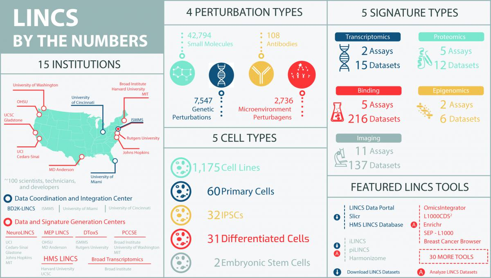



* __Lead instructor__ - Daniel Beiting, Assistant Professor of Pathobiology at PennVet. 
* __Teaching Assistants__ - Camila Amorim, PhD and Alex Berry, PhD.  
* __Time__ - Class meets weekly from 3-5pm at PennVet (see below for exceptions)
* __Location__ - Class meets in the main lecture halls on the 1st floor of PennVet Hill Pavilion (rooms 130 or 131)

## Introduction to RNAseq technology and data

**Jan 23rd** — After a brief overview of the course, we'll spend the opening lecture talking about Illumina's 'Sequencing by Synthesis' technology, and walk through the steps involved in planning for a transcriptomics experiment.  After this lecture, jargon like flow cell, single-end, paired-end, indexing, cluster density, library, ribo-depletion, scRNAseq, and fastq will pratically roll off your tongue.

* __[Lecture slides](https://www.icloud.com/keynote/0sBpheSjnnkSIjKEHDpzd6kmw#Lecture01%5FRNAseqIntro)__
* __TA help session__ - none
* __Class__ - Hill rm 130; 1-3PM
* __Homework__ – none

  

## Setting up your software environment

**Jan 30th** — In the first half of this lecture we'll discuss the open-source, cross-platform R/bioconductor software and environment that will be used throughout the course, and each student will set-up their own laptop to be a powerful, stand-alone bioinformatics workstation. 

* __[Lecture slides](http://bit.ly/1ToDM3R)__
* __TA help session__ - none 
* __Class__ - Hill rm 131; 3-5PM
* __Homework__ – [DataCamp Intro to R course (~2hrs)](https://www.datacamp.com/courses/free-introduction-to-r)

## Ultra-fast read mapping with Kallisto

**Feb 6th** — In this class we'll finally get down to the business of using [Kallisto](https://pachterlab.github.io/kallisto/about), software for memory-efficient mapping of your raw reads to a reference transcriptome.  You'll carry out this mapping in class, right on your laptop, while we discuss what's happening 'under the hood' with Kallisto and how this compares to more traditional alignment methods. 

* __[Lecture slides](https://www.icloud.com/keynote/02_yytlVoDebEIXctpJFMIkrg#Lecture03%5FKallistoAlignments)__
* __TA help__ - Hill rm 234 (library); 2-3pm 
* __Class__ - Hill rm 130; 3-5PM
* __Homework__ – [DataCamp Intro to R course (~2hrs)](https://www.datacamp.com/courses/free-introduction-to-r)

## Measuring digital gene expression

**Feb 13th** — Now that we've aligned our reads, it's time to discuss units for measuring gene expression.  We'll discuss differences between RPKM and TPM, and how these units relate to basic properties of your experiment.  We'll also discuss normalization *within* and *between* samples.  To conclude this class, we'll read our Kallisto data into the R environment.

* __[Lecture slides](https://www.icloud.com/keynote/0Oex4CzdWhhMZpcwwAmTjPwzA#Lecture04%5Funits)__
* __TA help__ - Hill rm 234 (library); 2-3pm 
* __Class__ - Hill rm 131; 3-5PM
* __Homework__ – TBD

## Exploratory analysis of gene expression data

**Feb 20th** — In this class we'll use Principle Component Analysis (PCA) to explore how variables such as sex, age, treatment, etc., that influence our data. We'll discuss common mis-steps and sources of variance in transcriptional data sets.  You'll also be introduced to the popular graphing package [ggplot2](http://ggplot2.org/), to graph the results of your PCA analysis.

* __[Lecture slides](https://www.icloud.com/keynote/0i4VPYHj9N0286jLLF20BYipw#Lecture05%5FexploratoryAnalysis)__
* __TA help__ - Hill rm 234 (library); 3-4pm 
* __Class__ - Hill rm 130; 1-3PM
* __Homework__ – TBD

## Managing and tidying expression data

**Feb 27th** — In this class we'll use Hadley Wickham's [dplyr](http://cran.rstudio.com/web/packages/dplyr/vignettes/introduction.html) package along with other tools from his [tidyverse](https://www.tidyverse.org/) of packages to take control over our gene expression dataframes, allowing us to change, sort, filter, arrange and summarize large data sets quickly and easily using simple commands in R.

* __TA help__ - Hill rm 234 (library); 2-3pm 
* __Class__ - Hill rm 130; 3-5PM
* __Homework__ – TBD

## Accessing public data

**March 7th** — *Thursday class!* - Today we'll discuss [LINCS](http://www.lincsproject.org/) and [ARCH4S](https://amp.pharm.mssm.edu/archs4/), two different large-scale efforts to make gene expression data from a vast array of samples easily accesslible. We'll use R/bioconductor to  query LINCS and ARCH4S, providing an opportunity to integrate your own data with gene expression data for almost 2 million samples! 

* __[Lecture slides]()__
* __TA help__ - Hill rm 234 (library); 2-3pm 
* __Class__ - Hill rm 131; 3-5PM
* __Homework__ – TBD

## Identifying differentially expressed transcripts

**March 13th** — The ultimate goal of most transcriptional profiling experiments is to identify differentailly expressed genes or transcripts.  We'll use the program [Sleuth](http://pachterlab.github.io/sleuth/) which like Kallisto is also a product of [Lior Pachter's lab](https://math.berkeley.edu/~lpachter/).  Because Sleuth is relatively new to the game, we'll also use the popular and venerable [Limma](http://www.bioconductor.org/packages/release/bioc/html/limma.html) package in R.  This gives us a chance to compare and contrast these two methods for identifying DETs.  We'll also have a chance to talk about special cases when your analyses should include a paired design or correct for batch effects. 

* __TA help__ - Hill rm 234 (library); 2-3pm 
* __Class__ - Hill rm 131; 3-5PM
* __Homework__ – TBD

## Module identification

**March 20th** — Lists of differentially expressed transcripts often include different patterns or modules of genes that are coordinately regulated across treatments or conditions, and these patterns can provide powerful insight into biology.  In this class you'll use correlation-based clustering methods and heatmap visualization to interrogate DEGs to reveal modules of co-regulated genes.

* __TA help__ - Hill rm 234 (library); 2-3pm 
* __Class__ - Hill rm 130; 3-5PM
* __Homework__ – TBD

## hackdash #1

**March 27th** — You may have heard of a Hackathon before - an event that typically lasts several days and brings together people for a collaborative challenge in computer programming.  Well, we don't quite have time for a full Hackathon, so we'll do a mad dash to the finish line instead.  The class will be broken up into small groups.  No grades will be given, but fun will be had by all!

* __TA help__ - Hill rm 234 (library); 2-3pm 
* __Class__ - Hill rm 130; 3-5PM
* __Homework__ – TBD

## Understanding and leveraging Gene Ontology

**April 3rd** — Now that you've identified differentially expressed genes, what do they mean and how do you begin to elucidate the biological pathways governed by these genes?  Toward this end, you will learn how to carry out functional enichment analyses using [Gene Ontology](http://geneontology.org/).  You'll also see some different options for how to present your functional enrichment results.

* __[Lecture slides](https://www.icloud.com/keynote/0Naa63iYXqX4nTRUq2PF0Rfpg#Lecture11%5FFunctionalEnrichment)__
* __TA help__ - Hill rm 234 (library); 2-3pm 
* __Class__ - Hill rm 130; 3-5PM
* __Homework__ – TBD

## Gene Set Enrichment Analysis (GSEA)

**April 10th** — We'll use [GSEA](http://www.broadinstitute.org/gsea/index.jsp) in conjunction with large collections of gene signatures available through the Broad Institute's [Molecular Signatures Database](http://www.broadinstitute.org/gsea/msigdb/index.jsp) to discover pathways involved in your biological system.  We'll explore both web-based and R/bioconductor strategies for carrying out GSEA.

* __TA help__ - Hill rm 234 (library); 2-3pm 
* __Class__ - Hill rm 130; 3-5PM
* __Homework__ – TBD

## hackdash #2

**April 17th** — In this second and final Hackdash, expect your most challening problem!  

* __TA help__ - Hill rm 234 (library); 2-3pm 
* __Class__ - Hill rm 130; 3-5PM
* __Homework__ – TBD

## Making your analysis transparent and reproducible

**April 24th** — In order to make your analysis pipeline transparent and reproducible, in this class you'll use [R Markdown](http://rmarkdown.rstudio.com/) and [Knitr](http://yihui.name/knitr/) to wrap up all your code and outputs (figures, tables, etc) together in a dyanmic document that can be placed in your lab notebook or published as a supplementary file in your manuscript.

* __[Lecture slides](https://www.icloud.com/keynote/0jx8AmcQUTZvZjBB4h65gVR9A#Lecture12%5FRmarkdown)__
* __TA help__ - Hill rm 234 (library); 2-3pm 
* __Class__ - Hill rm 130; 3-5PM
* __Homework__ – TBD

## Final exam

**May 1st** — During this in-class exam, I'll test your knowledge using a fun but challenging Jeopardy style Q&A. 

* __TA help__ - Hill rm 234 (library); 2-3pm 
* __Class__ - Hill rm 130; 3-5PM
* __Homework__ – TBD

